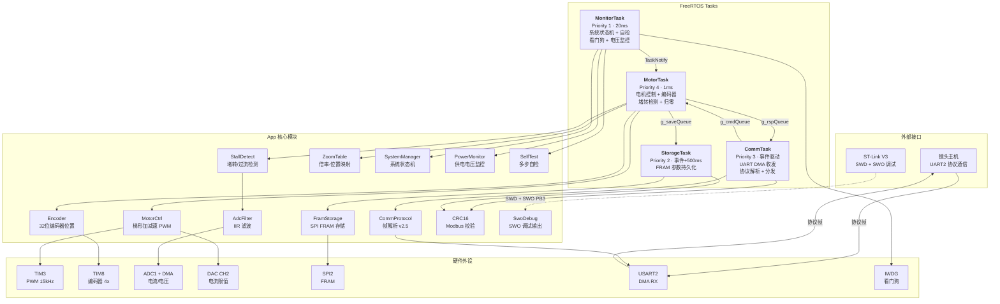
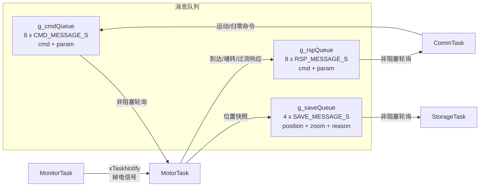
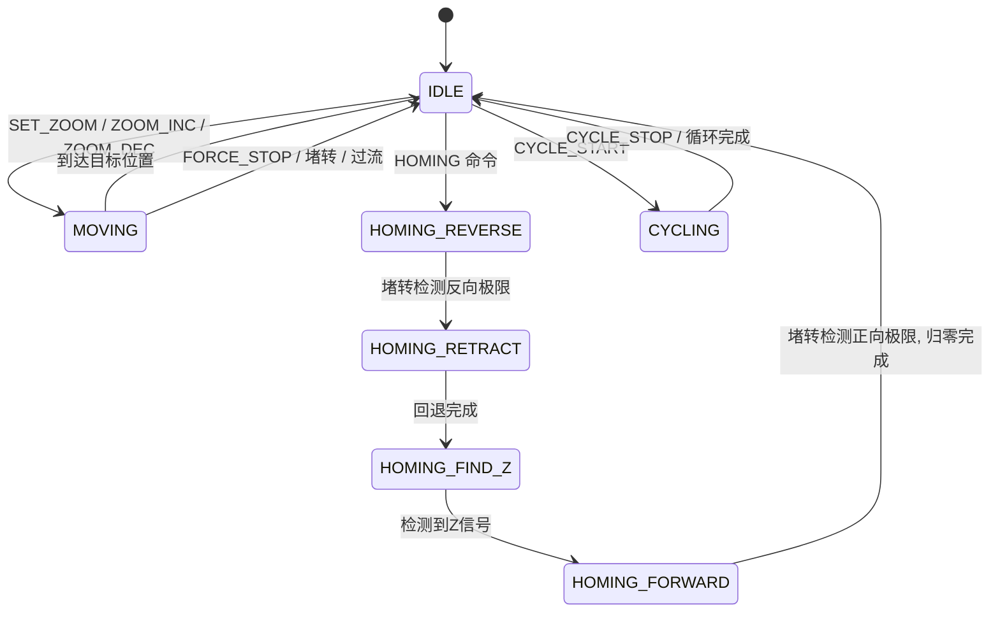
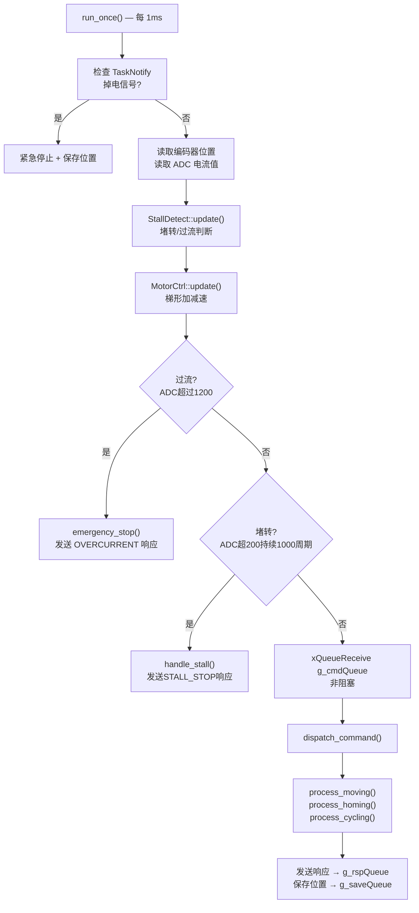
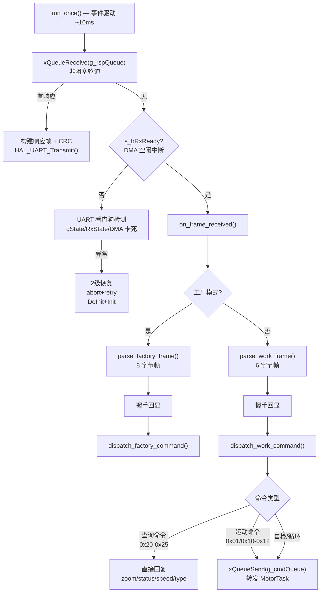
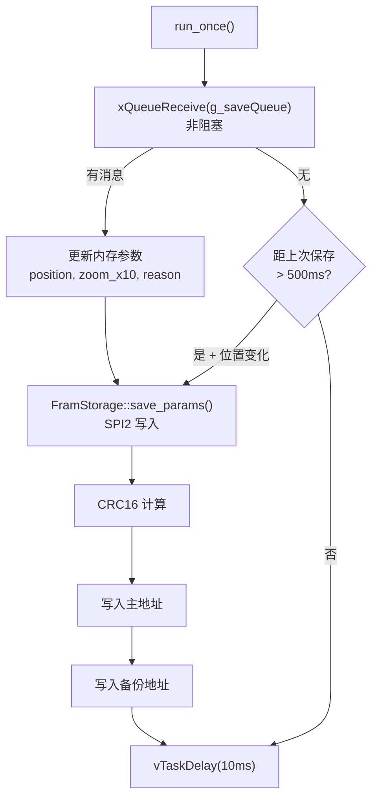
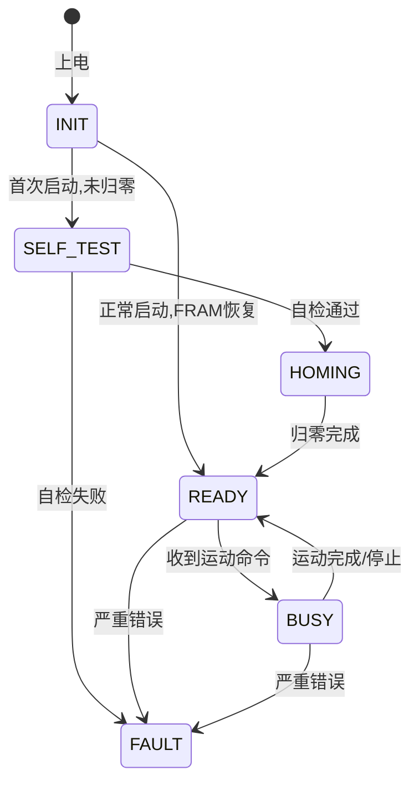
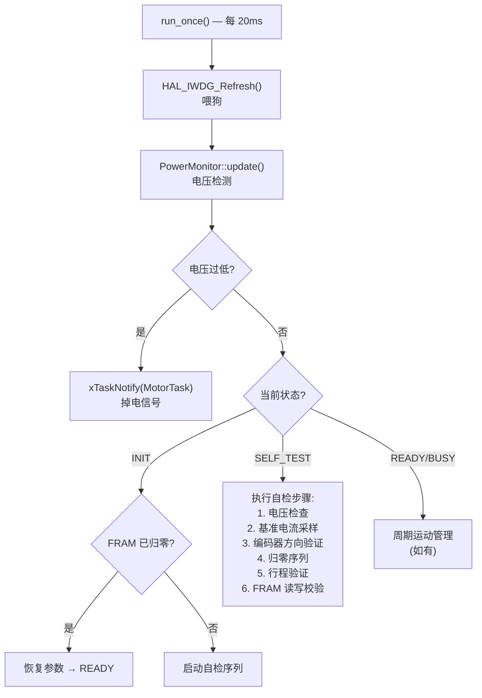
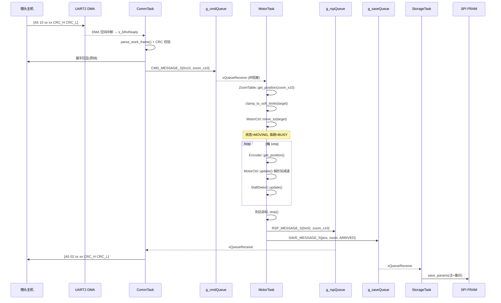
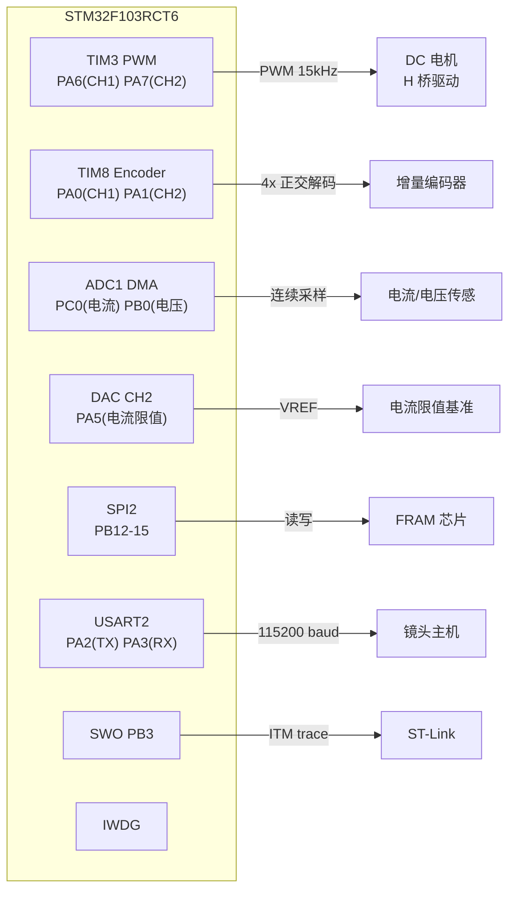

# ZLENS_DC 系统架构分析

## 1. 项目概况

ZLENS_DC 是基于 STM32F103RCT6 的**电动变倍镜头控制系统**，运行 FreeRTOS，采用 4 任务架构。
当前已完成 Phase 1-6，所有功能模块就绪。

---

## 2. 系统总架构



---

## 3. 任务间通信



---

## 4. 各任务架构与数据流

### 4.1 MotorTask — 电机控制任务 (Priority 4, 1ms)

**职责**: 电机状态机、梯形加减速、编码器读取、堵转/过流保护、软限位、归零序列、周期运动





**依赖模块**: MotorCtrl, Encoder, StallDetect, ZoomTable, AdcFilter

---

### 4.2 CommTask — 通信任务 (Priority 3, 事件驱动)

**职责**: UART DMA 接收、协议帧解析(工作/工厂模式)、CRC 校验、命令分发、响应发送、UART 看门狗



**依赖模块**: CommProtocol, CRC16

**UART 接收链路**:
```
UART2 RX DMA → 空闲线检测 ISR → s_bRxReady 标志 → CommTask 轮询处理
```

---

### 4.3 StorageTask — 存储任务 (Priority 2, 事件+周期)

**职责**: FRAM 参数持久化(位置、倍率、总行程等)、启动恢复、事件驱动保存 + 周期保存



**存储内容**:
| 参数 | 说明 |
|------|------|
| position (int32) | 编码器绝对位置 |
| zoom_x10 (uint16) | 当前倍率 ×10 |
| total_range (int32) | 总行程(归零后测得) |
| bHomingDone (bool) | 是否已完成归零 |
| overflow_cnt (int32) | 编码器溢出计数 |
| baseline_current (uint16) | 基准电流 |

**依赖模块**: FramStorage, CRC16

---

### 4.4 MonitorTask — 监控任务 (Priority 1, 20ms)

**职责**: 系统状态机管理、自检编排、看门狗喂狗、掉电检测、首次/正常启动判断





**自检项目 (SelfTest)**:
1. **电压检查** — ADC 读取供电电压是否在范围内
2. **基准电流** — 空载时采样 ADC 电流基准值
3. **编码器方向** — 短暂驱动电机，验证编码器增减方向正确
4. **归零序列** — 完整归零流程
5. **行程验证** — 测量总行程是否在合理范围
6. **FRAM 校验** — 写入/读回验证 SPI FRAM 正常

**依赖模块**: SystemManager, PowerMonitor, SelfTest, SwoDebug

---

## 5. 完整数据流 — Zoom 命令示例



---

## 6. 硬件外设映射



---

## 7. 模块职责一览

| 模块 | 文件 | 职责 |
|------|------|------|
| **MotorCtrl** | `App/*/motor_ctrl.*` | PWM 控制、梯形加减速、方向切换、DAC 电流限值 |
| **Encoder** | `App/*/encoder.*` | TIM8 正交解码、32 位扩展(溢出中断)、无竞争读取 |
| **StallDetect** | `App/*/stall_detect.*` | 电流阈值堵转检测、过流保护、消隐期管理 |
| **ZoomTable** | `App/*/zoom_table.*` | 倍率-编码器位置映射表、线性插值 |
| **FramStorage** | `App/*/fram_storage.*` | SPI FRAM 读写、主/备份双地址、CRC 校验 |
| **CommProtocol** | `App/*/comm_protocol.*` | 工作/工厂模式帧解析、CRC 校验、协议 v2.5 |
| **SystemManager** | `App/*/system_manager.*` | 系统状态机(INIT→SELF_TEST→HOMING→READY→BUSY→FAULT) |
| **PowerMonitor** | `App/*/power_monitor.*` | ADC 供电电压监控、掉电预警 |
| **SelfTest** | `App/*/self_test.*` | 多步自检编排(电压→基准→编码器→归零→行程→FRAM) |
| **AdcFilter** | `App/*/adc_filter.*` | IIR 低通滤波(alpha=1/16) |
| **CRC16** | `App/*/crc16.*` | CRC16-Modbus 校验算法 |
| **SwoDebug** | `App/*/swo_debug.*` | SWO ITM 调试打印(PB3) |
| **AppInstances** | `App/*/app_instances.*` | 全局单例 + 外设初始化 + 任务创建 |
